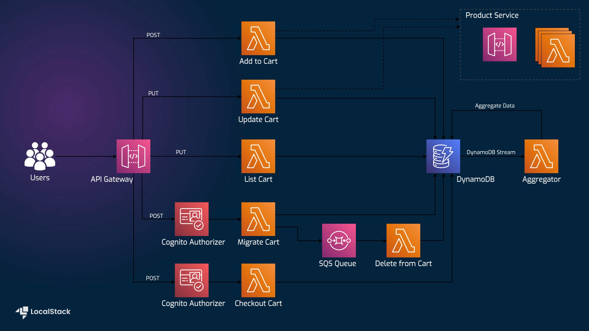

# Serverless Shopping Cart with API Gateway, Lambda, Cognito, SQS, DynamoDB, and Amplify SDK

## Architecture diagram

| Endpoint                   | Method | Description                                                                                                                     |
| -------------------------- | ------ | ------------------------------------------------------------------------------------------------------------------------------- |
| `/cart`                    | `GET`  | Retrieve the shopping cart for a user, whether anonymous or logged in.                                                          |
| `/cart`                    | `POST` | Accepts a JSON payload containing product ID and quantity. Adds the specified quantity of an item to the cart.                  |
| `/cart/migrate`            | `POST` | This endpoint is called after logging in to migrate items from an anonymous user's cart to the logged-in user's cart.           |
| `/cart/checkout`           | `POST` | Empty the shopping cart.                                                                                                        |
| `/cart/{product-id}`       | `PUT`  | Accepts a JSON payload containing product ID and quantity. Updates the quantity of the specified item in the cart.              |
| `/cart/{product-id}/total` | `GET`  | Retrieve the total amount of a given product across all carts. This API is not used by the frontend but can be manually tested. |
| `/product`                 | `GET`  | Retrieve details for all products.                                                                                              |
| `/product/{product_id}`    | `GET`  | Retrieve details for a single product.                                                                                          |

